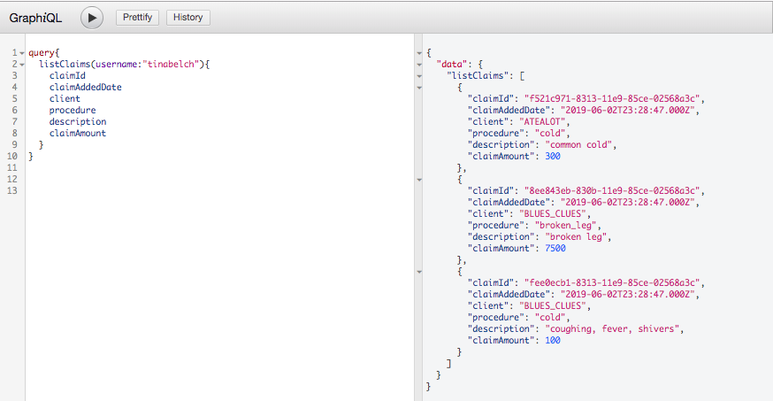
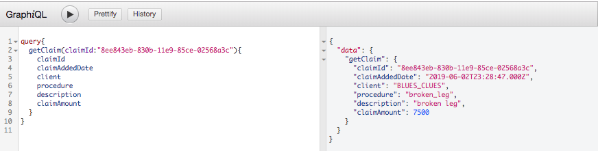

# insurance_backend

This application is used to track individual users and claims across multiple heath insurance carriers. There are three separate components along with test cases (using Mocha and Chai). 
1. Database - There is one main database (***YaroDB***) and an additional database for each client 
2. Command Line Utility - This has functions for creating the database schema, adding sample data, and adding new clients to databases. 
3. Backend - The GrapqhQl backend supports querying the database.


## Table of Contents
* [Local Setup](#local-setup)
* [GraphiQL Queries](#graphiql-queries)
* [How to Create and Populate Database using the CLI](#how-to-create-and-populate-database-using-the-cli)
* [Database Schema](#database-schema)


## Local Setup
1. Clone repo
2. Install packages:
    * If using docker, type `make build-docker` then `make create-container`
    * If not using docker, type `npm install` where there is a package.json 
3. In utils/utils.js:
    * Use my connection info (ask for password) or create your own:
       ```
       'connectionLimit' : SET_A_LIMIT,
       'host' : 'LOCALHOST_OR_OTHER_HOSTING_OPTIONS',
       'user' : 'USERNAME'
       ```
    * Add password:
      * If using docker, type `export PASSWORD=SECRET_PASSWORD`
4. Where there is a package.json, type `npm start`


## GraphiQL Queries

1. listClaims
    * takes in a username
    * lists the users claims from both databases
2. getClaim
    * takes in a claim id
    * returns more detailed information about the claim
    
    
**listClaims Example:**


**getClaim Example:**



## How to Create and Populate Database using the CLI

1. cd ddl/
2. Type 
  * `node cli.js <command>`
    * `-h` or `--help` will print commands and description
    * `create_yaro_db`
      * needs to be ran once to create YaroDB
      * needs to be ran before adding sample data or adding client database
      * creates tables: YARO_USER, YARO_CLIENT, YARO_ACTIVE_USER
    * `add_sample_data`
      * adds sample data that is in /sample_data.js
      * creates 2 sample databases
      * creates 3 sample users with claims and connections with client databases
    * `create_client_db <client_name>`
      * creates client databases
      * creates tables: CLAIM_TYPE, CLAIMS
      * adds client into YARO_CLIENT

    
    
## Database Schema 
This application creates and populates (sample data) a database for tracking insurance clients and claims. 
Three separate databases are created: YaroDB, ClientA (BLUES_CLUES), and ClientB (ATEALOT).

In ***YaroDB***, there's a table called **YARO_USER** with columns `yaro_user_id`, `email`, `username`, `first_name`, `last_name`, `city`, `state`, `dob`, and `user_added_date`. **YARO_CLIENT** with `client_id`, `client_db_name`, `client_name`, and `client_added_date`. **YARO_ACTIVE_USER** with `yaro_user_id`, `client_id`, and `active`.

***ClientA*** and ***ClientB*** will both have a table called **CLAIM_TYPE** and **CLAIMS**. Rows will be linked to the YaroDB via the ‘yaro_user_id’. **CLAIM_TYPE** consists of `claim_type_id`, `procedure_name`, and `description`. **CLAIMS** consists of `claim_id`, `yaro_user_id`, `client_id`, `claim_type_id`, and `claim_amount`.


